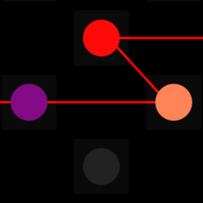

<h1 align="center">
  
</h1>

*An Accessible Digital Musical Instrument for playing melodies.*

Please refer to the [Netytar page](https://neeqstock.notion.site/Netytar-b61e054d327e4543a2b8bb135359d58b) on Nicola Davanzo's personal website for more informations, instrument description and usage guide.

 

        

 

## Requirements
- A computer equipped with a Windows operating system
- Any sensor capable of moving the mouse cursor, which will be used for chord selection and to navigate the interface
    - _(Suggested)_ an eye tracker, with some proper software
    - _(Suggested)_ an eye tracker, with a NITH wrapper software
- Any of these NITH sensors, which will control note onset and offset, intensity and dynamics
    - [NITHbreathSensor](https://neeqstock.notion.site/NITHbreathSensor-5010DP-b23a43406b4d432d974a42bbe0f63695) - which provides the original interaction method for which Netytar was thought for
	- [NITHheadTracker](https://neeqstock.notion.site/NITHheadTracker-BNO055-eda9cb4d752c45869abd85d06a1d7e5d)
    - [NITHbiteSensor](https://neeqstock.notion.site/NITHbiteSensor-FSR-d0dabadc9abe470eb583985b22f3d2a9)

If you don't possess any of these sensors you will still be able to try Netytar using your mouse, and play using the spacebar.

## Installation and running

1. Download the latest release from the [Releases](https://github.com/LIMUNIMI/Netytar/releases)
 page
2. Unzip the archive
3. Run `Netytar.exe`

## Contribution

Netytar is licensed through a GNU GPL-v3 Free Open-Source software license. Feel free to fork this repository and contribute!
### Dependencies
- [.NET 8](https://dotnet.microsoft.com/en-us/download/dotnet/8.0), which SDK and development tools can be automatically downloaded within the [Visual Studio](https://visualstudio.microsoft.com/it/downloads/) installer
- Netychords depends on [NITHlibrary](https://github.com/LIMUNIMI/NITHlibrary) and [NITHdmis](https://github.com/LIMUNIMI/NITHdmis). Please clone both of them, and place them in an adjacent folder to your Netychords folder. Visual Studio should automatically locate them after opening `Netytar.sln`

## Issues

If you have any issue and/or proposal, please open a GitHub issue on the [Issues page](https://github.com/LIMUNIMI/Netytar/issues) of this repository, or write an e-mail to: *nicola(dot)davanzo(at)unimi(dot)it*